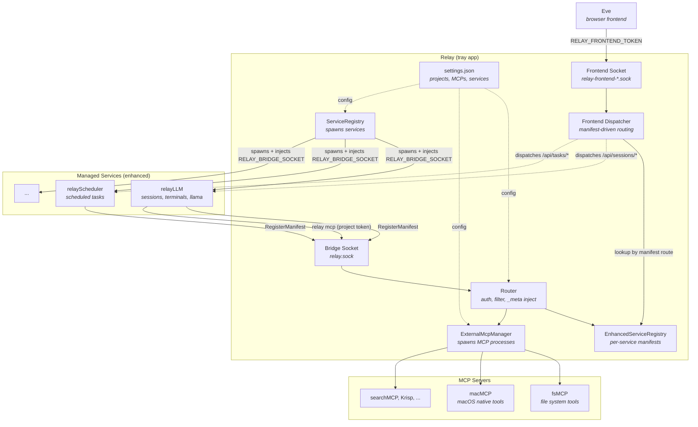
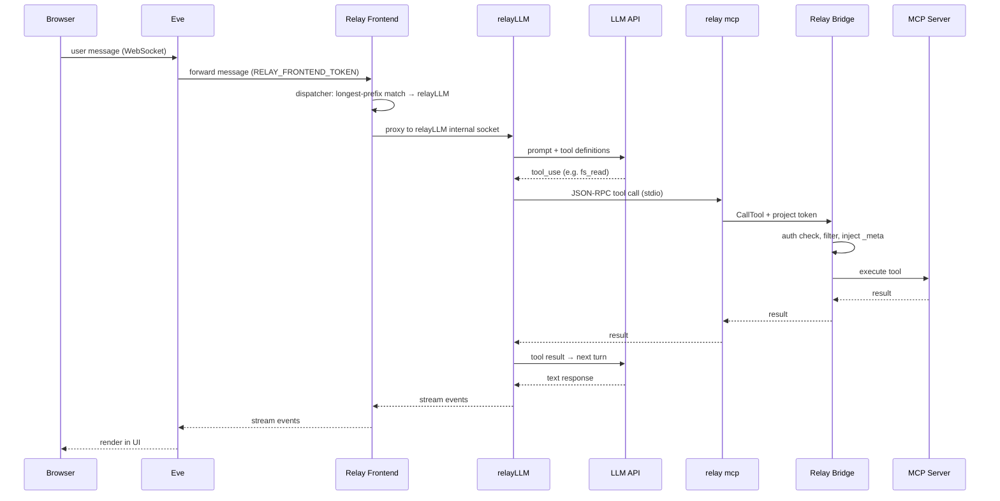
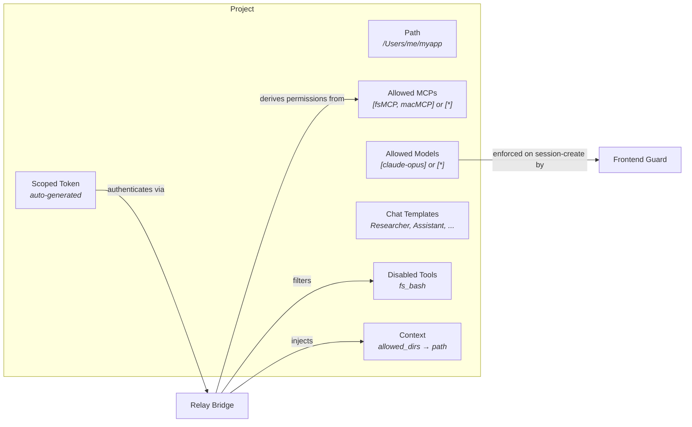

# Relay

macOS MCP orchestrator and project manager. Manages external MCP servers, background services, and project-scoped access control through a menubar tray app with a Unix socket bridge. Built with Go.

## Architecture



## Request Flow

How a user prompt becomes a tool call:



For `/api/tasks/*` traffic the same flow applies — relay's dispatcher routes to relayScheduler directly instead of relayLLM, based on each service's registered manifest. No service holds hardcoded knowledge of another. See [`plans/service-manifest-spec.md`](./plans/service-manifest-spec.md).

## Projects

Projects are the primary unit of organization and security. Each project defines an infrastructure boundary.



- **`allowed_mcp_ids: ["*"]`** — access all registered MCPs
- **`allowed_models: ["*"]`** — use any model
- **`disabled_tools`** — `fs_bash` blocked by default for filesystem MCPs
- **`context`** — `allowed_dirs` auto-set to project path for fsMCP

**Two allowlists, two enforcement points:**

- **`allowed_mcp_ids`** is enforced at the **bridge**. The project token is the
  security boundary — permissions are derived from `allowed_mcp_ids` at auth time
  (`AuthenticateProjectByHash`), not stored separately, and `checkToolAccess`
  gates every `ListTools`/`CallTool`. A project can neither see nor call tools
  from an MCP it doesn't list, nor a tool named in `disabled_tools`.
- **`allowed_models`** is enforced at the **frontend socket**, not at the bridge.
  relayLLM has no project knowledge, so the model allowlist can only be applied
  in front of it: `frontend_model_guard.go` rejects a `POST /api/sessions` that
  names a model outside the project's list with `403` before it reaches relayLLM.

For both, `["*"]` (or an empty list) means unrestricted — see `isWildcard`.

## Prerequisites

- macOS 13+
- Go 1.22+

## Build & Install

```bash
./build.sh
```

Builds the Go binary with CGO, assembles `Relay.app` (with generated icon and codesigning), and installs to `/Applications/Relay.app`.

For notarized release builds:

```bash
./build.sh --release
```

### Code signing

All builds run codesign with hardened runtime so dev and release behavior stay in sync. The first `Developer ID Application` cert in your login keychain is picked automatically; if none exists, the build falls back to ad-hoc signing (fine for local dev, won't pass Gatekeeper).

To pin a specific cert when multiple are present:

```bash
RELAY_SIGN_IDENTITY="Developer ID Application: Your Name (TEAMID)" ./build.sh
```

Sibling services (`../relayLLM/build.sh`, `../relayScheduler/build.sh`) use the same selection logic and honor the same env var, so all four binaries ship under one identity.

## Usage

1. Launch Relay from `/Applications/Relay.app`
2. Open Settings from the menubar icon
3. Register MCP servers and create projects
4. Use Eve or connect external tools with a project token

## Execution Modes

- **`relay`** (default) — menubar tray app. Hosts bridge socket, manages services and projects.
- **`relay mcp --token <value>`** — stdio MCP server. Connects to bridge socket. Token determines which tools are visible.
- **`relay mcp register|unregister|list`** — CLI for external MCP server management.
- **`relay mcpList --token <value>`** — lists tools available to a token.
- **`relay mcpExec --token <value> --list|--tool <name> [--args '<json>']`** — calls tools directly over the bridge.
- **`relay service register|unregister|restart|list`** — CLI for background service management. `restart` performs an in-place Stop+Start via the running tray.

## Security

- **Project tokens** — each project gets a scoped token. Permissions derived from `allowed_mcp_ids` at auth time. Token + SHA-256 hash stored in `settings.json` (mode 0600).
- **Service tokens** — ephemeral, in-memory. Injected into managed services at spawn (`RELAY_MCP_TOKEN`). Full bridge access for administrative operations.
- **Frontend channel** — Eve and other frontend consumers dial `RELAY_FRONTEND_SOCKET` (Unix socket, mode 0600) with `RELAY_FRONTEND_TOKEN`. Bearer-checked on every HTTP + WS request before dispatch.
- **Enhanced internal sockets** — each enhanced service picks its own internal socket + token and declares both in its `RegisterManifest` payload. Relay strips inbound Authorization and injects the service-declared token when proxying.
- **OAuth 2.1** — HTTP MCPs use PKCE (S256), dynamic client registration, auto-refresh.
- **MCP data is runtime-only** — tool definitions and context schemas discovered during handshake, never persisted.

## External MCP Servers

Register via CLI or Settings UI. Relay proxies their tools through the authenticated bridge.

```bash
relay mcp register --name macMCP --command ~/.local/bin/macmcp
relay mcp register --name Krisp --transport http --url https://mcp.krisp.ai/mcp
relay mcp list
relay mcp unregister --name macMCP
```

`register` is idempotent. Sends reconcile signal to the running tray app.

## Services

Manage background processes via Settings or CLI. Commands run through a login shell.

```bash
relay service register --name Eve --command node --args server.js --workdir . --url http://localhost:3000 --autostart
relay service list
relay service restart --name Eve     # or --id <service-id>
relay service unregister --name Eve
```

`register` is idempotent and hot-reloads running services. `restart` does a clean Stop → Start through the running tray, so listen ports and ephemeral tokens are released and reissued.

### Crash recovery

When the tray exits cleanly, each service is SIGTERMed by the reaper goroutine and its pidfile removed. When the tray is SIGKILLed or force-quit, children get reparented to launchd and keep their listen ports — the next launch would otherwise fail autostart with `EADDRINUSE`.

To make this self-healing, every spawned service writes its process-group PID to `~/Library/Application Support/relay/run/<service-id>.pid`. On the next tray launch, `ReclaimOrphans` runs immediately before autostart: for each pidfile it (1) checks the process group is still alive, (2) verifies the command line still matches the configured service via BSD `ps` (defeats PID recycling), then SIGTERMs the group. Stale pidfiles are removed silently.

## Logs

```bash
tail -f ~/Library/Application\ Support/relay/logs/<service-id>.log
```

## Ecosystem

Relay orchestrates 6+ connected projects:

**Services** (managed via `relay service register`):
- **[relayLLM](https://github.com/barelyworkingcode/relayLLM)** — LLM execution engine. Receives directory + model + token, streams results.
- **[Eve](https://github.com/barelyworkingcode/eve)** — Browser-based frontend. Fetches projects from relay, resolves templates, manages file browser.
- **[relayScheduler](https://github.com/barelyworkingcode/relayScheduler)** — Task scheduler. Runs LLM prompts on schedule.
- **[relayTelegram](https://github.com/barelyworkingcode/relayTelegram)** — Telegram bot bridge.

**MCP Servers** (managed via `relay mcp register`):
- **[macMCP](https://github.com/barelyworkingcode/macMCP)** — 41 macOS-native tools (Calendar, Contacts, Mail, Messages, Maps, etc.).
- **[fsMCP](https://github.com/barelyworkingcode/fsmcp)** — File system tools with per-project directory scoping via `_meta.allowed_dirs`.

## License

MIT
