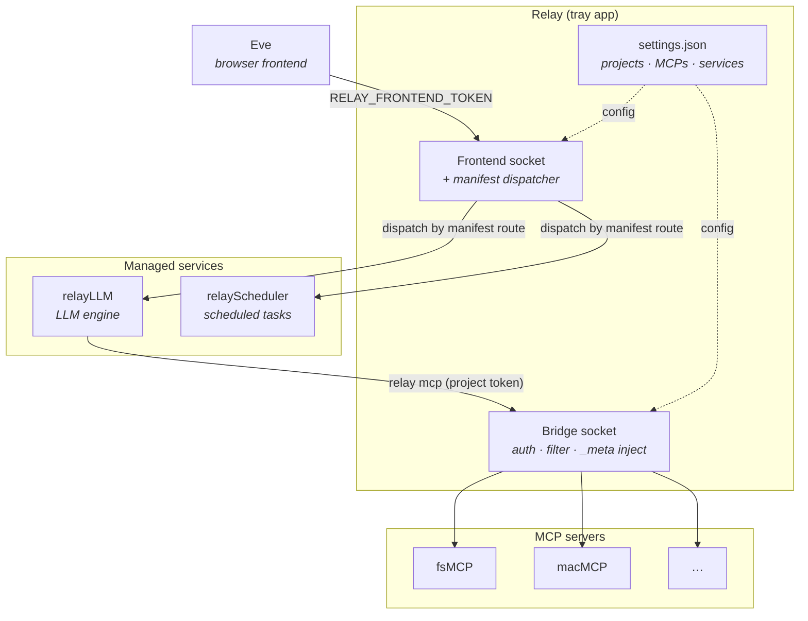

# Relay

macOS MCP orchestrator and project manager. A menubar tray app that manages
external MCP servers, runs background services, and enforces project-scoped
access control through a Unix-socket bridge. Built with Go.

Relay is the hub of a small ecosystem: a browser frontend ([Eve](https://github.com/barelyworkingcode/eve))
talks to it, an LLM engine ([relayLLM](https://github.com/barelyworkingcode/relayLLM))
runs prompts through it, and MCP servers ([macMCP](https://github.com/barelyworkingcode/macMCP),
[fsMCP](https://github.com/barelyworkingcode/fsmcp)) expose tools behind it —
all gated by per-project permissions.

## How it fits together



A browser message flows **Eve → relay's frontend socket → the manifest
dispatcher → the service that owns the route** (e.g. relayLLM). When an LLM in
that service calls a tool, the call goes **`relay mcp` (carrying a project
token) → the bridge (auth, tool filtering, `_meta` injection) → the MCP server**
and back. Services hold no hardcoded knowledge of each other — each declares the
routes it serves in a manifest and relay routes accordingly. See
[`docs/service-manifest.md`](./docs/service-manifest.md).

## Projects

Projects are the primary unit of organization and security. Each project binds a
filesystem path to a set of permissions and a scoped token:

- **`allowed_mcp_ids`** — which MCP servers the project may use (`["*"]` = all).
- **`allowed_models`** — which models it may run (`["*"]` = all).
- **`disabled_tools`** — tools to block (e.g. `fs_bash`, off by default for
  filesystem MCPs).
- **`context`** — auto-set values such as `allowed_dirs` (scoped to the project
  path for fsMCP).
- a scoped **token**, auto-generated, that is the project's security boundary.

Two allowlists enforced at two points: the **MCP allowlist** is enforced at the
**bridge** — the project token derives exactly which tools are visible and
callable. The **model allowlist** is enforced at the **frontend** before a
request reaches relayLLM (which has no project knowledge). Internals live in
[`docs/decisions/007-project-token-brokering.md`](./docs/decisions/007-project-token-brokering.md).

## Prerequisites

- macOS 13+
- Go 1.25+ (see `go.mod`)

## Build & install

```bash
./build.sh              # build + install /Applications/Relay.app and launch it
./build.sh --test       # run the hermetic test suite first; abort install on failure
./build.sh --release    # sign + notarize + emit /tmp/Relay.dmg (Developer ID required)
```

`--release` implies `--test`. Every build codesigns with hardened runtime so dev
and release behave the same. The first `Developer ID Application` cert in your
login keychain is used automatically; with none, the build falls back to ad-hoc
signing (fine for local dev, won't pass Gatekeeper). Pin a specific identity:

```bash
RELAY_SIGN_IDENTITY="Developer ID Application: Your Name (TEAMID)" ./build.sh
```

Sibling services (`../relayLLM/build.sh`, `../relayScheduler/build.sh`) honor the
same selection logic and env var, so all binaries ship under one identity.

## Usage

1. Launch Relay from `/Applications/Relay.app`.
2. Open Settings from the menubar icon.
3. Register MCP servers and create projects.
4. Use Eve, or connect an external tool with a project token.

## Execution modes

- **`relay`** (default) — menubar tray app. Hosts the bridge socket, manages
  services and projects, shows the settings UI.
- **`relay mcp --token <value>`** — stdio MCP server. Connects to the bridge;
  the token determines which tools are visible.
- **`relay mcp register|unregister|list`** — manage external MCP servers.
- **`relay mcp call --token <value> --list | --tool <name> [--args '<json>']`** —
  list or invoke tools over the bridge in one shot (also spelled `relay mcpExec`).
- **`relay service register|unregister|restart|list`** — manage background
  services. `restart` does an in-place Stop → Start via the running tray.

## Security

Relay is the sole broker of credentials in the ecosystem. The model, in brief:

- **Project tokens** scope MCP access per project; the token *is* the boundary.
  Stored as plaintext + SHA-256 hash in `settings.json` (mode 0600).
- **Service tokens** (`RELAY_SERVICE_TOKEN`) are ephemeral, in-memory, full
  bridge access — injected into managed services for their own bridge calls,
  never into a spawned child shell (fail closed).
- **Frontend channel** — consumers dial `RELAY_FRONTEND_SOCKET` (0600) with
  `RELAY_FRONTEND_TOKEN`, bearer-checked on every request before dispatch.
- **Enhanced internal sockets** — each enhanced service picks its own socket +
  token and declares both via its manifest; relay strips inbound auth and
  injects the service-declared token when proxying.
- **OAuth 2.1** for HTTP MCPs (PKCE, dynamic registration, auto-refresh).
- **TCC permissions** — relay holds the personal-information entitlements and
  fires the prompts; MCPs declare what they need and inherit grants via
  responsible-parent attribution.

Full credential inventory: [`docs/tokens.md`](./docs/tokens.md). Token-brokering
rationale: [`docs/decisions/007-project-token-brokering.md`](./docs/decisions/007-project-token-brokering.md).

## External MCP servers

Register via CLI or the Settings UI; relay proxies their tools through the
authenticated bridge. `register` is idempotent and signals the running tray to
reconcile.

```bash
relay mcp register --name macMCP --command ~/.local/bin/macmcp
relay mcp register --name Krisp --transport http --url https://mcp.krisp.ai/mcp
relay mcp list
relay mcp unregister --name macMCP
```

## Services

Manage background processes via the Settings UI or CLI. Commands run through a
login shell. `register` is idempotent and hot-reloads running services; `restart`
does a clean Stop → Start through the running tray so listen ports and ephemeral
tokens are released and reissued.

```bash
relay service register --name Eve --command node --args server.js --workdir . --url http://localhost:3000 --autostart
relay service list
relay service restart --name Eve
relay service unregister --name Eve
```

Services write a pidfile, so when the tray is force-quit (leaving children
reparented to launchd with their ports held), the next launch reclaims the
orphans before autostart instead of failing on `EADDRINUSE`.

## Logs

```bash
tail -f ~/Library/Application\ Support/relay/logs/<service-id>.log
```

## Ecosystem

**Services** (managed via `relay service register`):

- **[relayLLM](https://github.com/barelyworkingcode/relayLLM)** — LLM execution engine; streams results for a given directory, model, and token.
- **[Eve](https://github.com/barelyworkingcode/eve)** — browser frontend; fetches projects from relay, resolves templates, browses files.
- **[relayScheduler](https://github.com/barelyworkingcode/relayScheduler)** — runs LLM prompts on a schedule.
- **[relayTelegram](https://github.com/barelyworkingcode/relayTelegram)** — Telegram bot bridge.

**MCP servers** (managed via `relay mcp register`):

- **[macMCP](https://github.com/barelyworkingcode/macMCP)** — 42 macOS-native tools (Calendar, Contacts, Mail, Messages, Maps, …).
- **[fsMCP](https://github.com/barelyworkingcode/fsmcp)** — 6 file system tools, scoped per project via `_meta.allowed_dirs`.

## License

MIT
