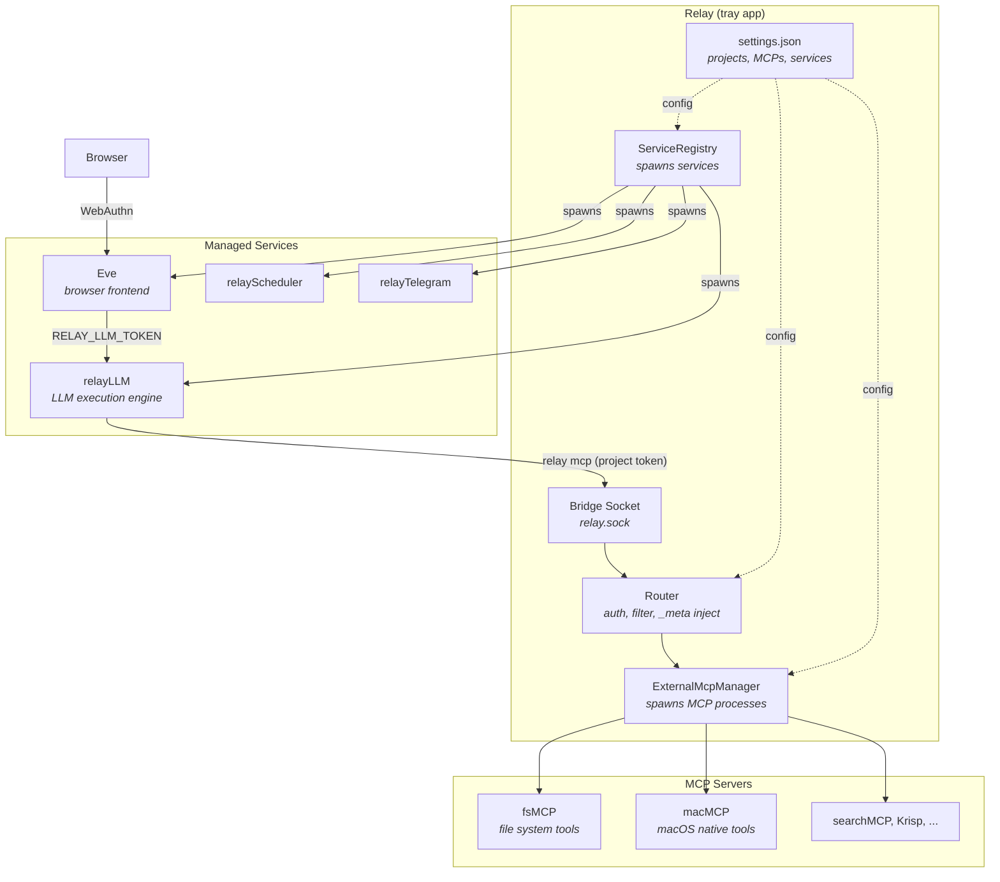
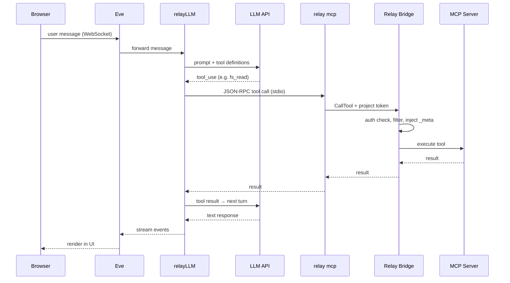
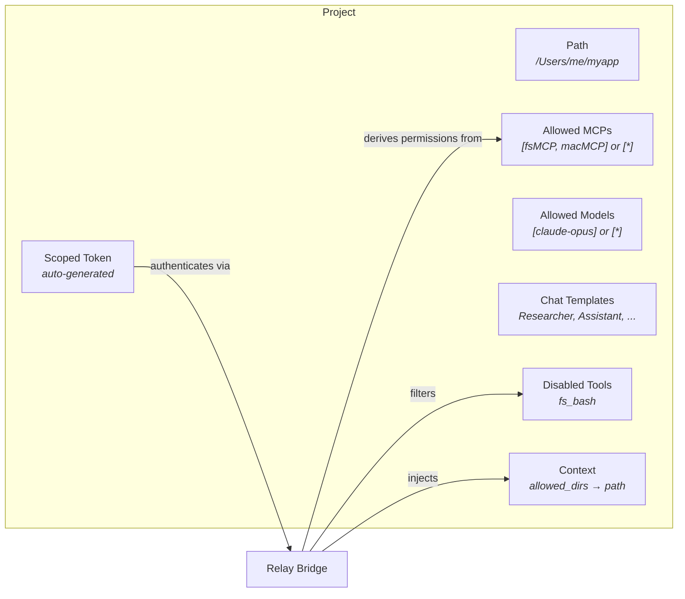

# Relay

macOS MCP orchestrator and project manager. Manages external MCP servers, background services, and project-scoped access control through a menubar tray app with a Unix socket bridge. Built with Go.

## Architecture



## Request Flow

How a user prompt becomes a tool call:



## Projects

Projects are the primary unit of organization and security. Each project defines an infrastructure boundary.



- **`allowed_mcp_ids: ["*"]`** — access all registered MCPs
- **`allowed_models: ["*"]`** — use any model
- **`disabled_tools`** — `fs_bash` blocked by default for filesystem MCPs
- **`context`** — `allowed_dirs` auto-set to project path for fsMCP

The project token is the security boundary. Permissions are derived at auth time from `allowed_mcp_ids` — not stored separately.

## Prerequisites

- macOS 13+
- Go 1.22+

## Build & Install

```bash
./build.sh
```

Builds the Go binary with CGO, assembles `Relay.app` (with generated icon and codesigning), and installs to `/Applications/Relay.app`.

For notarized release builds:

```bash
./build.sh --release
```

## Usage

1. Launch Relay from `/Applications/Relay.app`
2. Open Settings from the menubar icon
3. Register MCP servers and create projects
4. Use Eve or connect external tools with a project token

## Execution Modes

- **`relay`** (default) — menubar tray app. Hosts bridge socket, manages services and projects.
- **`relay mcp --token <value>`** — stdio MCP server. Connects to bridge socket. Token determines which tools are visible.
- **`relay mcp register|unregister|list`** — CLI for external MCP server management.
- **`relay mcpList --token <value>`** — lists tools available to a token.
- **`relay mcpExec --token <value> --list|--tool <name> [--args '<json>']`** — calls tools directly over the bridge.
- **`relay service register|unregister|list`** — CLI for background service management.

## Security

- **Project tokens** — each project gets a scoped token. Permissions derived from `allowed_mcp_ids` at auth time. Token + SHA-256 hash stored in `settings.json` (mode 0600).
- **Service tokens** — ephemeral, in-memory. Injected into managed services at spawn. Full bridge access for administrative operations.
- **Eve ↔ relayLLM** — separate trust boundary. `RELAY_LLM_TOKEN` + Unix socket (mode 0600). Not reusable as MCP token.
- **OAuth 2.1** — HTTP MCPs use PKCE (S256), dynamic client registration, auto-refresh.
- **MCP data is runtime-only** — tool definitions and context schemas discovered during handshake, never persisted.

## External MCP Servers

Register via CLI or Settings UI. Relay proxies their tools through the authenticated bridge.

```bash
relay mcp register --name macMCP --command ~/.local/bin/macmcp
relay mcp register --name Krisp --transport http --url https://mcp.krisp.ai/mcp
relay mcp list
relay mcp unregister --name macMCP
```

`register` is idempotent. Sends reconcile signal to the running tray app.

## Services

Manage background processes via Settings or CLI. Commands run through a login shell.

```bash
relay service register --name Eve --command node --args server.js --workdir . --url http://localhost:3000 --autostart
relay service list
relay service unregister --name Eve
```

`register` is idempotent and hot-reloads running services.

## Logs

```bash
tail -f ~/Library/Application\ Support/Relay/logs/<service-id>.log
```

## Ecosystem

Relay orchestrates 6+ connected projects:

**Services** (managed via `relay service register`):
- **[relayLLM](https://github.com/barelyworkingcode/relayLLM)** — LLM execution engine. Receives directory + model + token, streams results.
- **[Eve](https://github.com/barelyworkingcode/eve)** — Browser-based frontend. Fetches projects from relay, resolves templates, manages file browser.
- **[relayScheduler](https://github.com/barelyworkingcode/relayScheduler)** — Task scheduler. Runs LLM prompts on schedule.
- **[relayTelegram](https://github.com/barelyworkingcode/relayTelegram)** — Telegram bot bridge.

**MCP Servers** (managed via `relay mcp register`):
- **[macMCP](https://github.com/barelyworkingcode/macMCP)** — 41 macOS-native tools (Calendar, Contacts, Mail, Messages, Maps, etc.).
- **[fsMCP](https://github.com/barelyworkingcode/fsmcp)** — File system tools with per-project directory scoping via `_meta.allowed_dirs`.

## License

MIT
