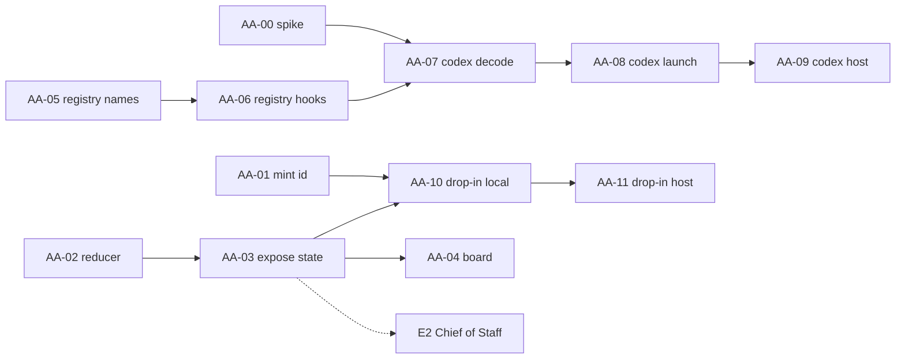
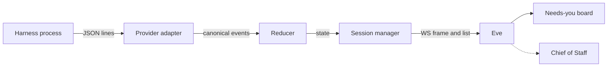

# Epic E1 · Agent attention

**Status: Needs review.** Every file in this folder is a draft.

## Goal

A person runs many agents at once. The person cannot watch all of them.

This epic makes relay report what each agent is doing. It reports one state per session. The state is the same for every harness.

The state feeds a "needs you" board in eve. It also feeds the Chief of Staff in [E2](../chief-of-staff/README.md).

## Terms

| Term | Meaning |
|---|---|
| Harness | A coding agent program. Claude Code, pi and Codex are harnesses. |
| Session | One running conversation with one harness. |
| Canonical event | A harness event after relay translates it into the one relay schema. |
| State | One word that says what a session is doing now. |
| Reducer | Code that turns a stream of canonical events into a state. |
| Drop-in | A person takes over a headless session in a terminal. |

## What exists today

Claude web chat already runs as JSON in and JSON out. Relay starts `claude` with `stream-json` in both directions. Pi runs in `--mode rpc`. Both translate into canonical events. See [session-host.md](../../session-host.md).

Codex has no provider. The state reducer does not exist. A session id is learned after launch, not before.

## Decisions

**D1 · Approvals are deferred.** Unattended agents run with permissions bypassed. Claude uses `--dangerously-skip-permissions`. Codex uses its yolo mode. The owner accepts the risk and works in virtual machines. A later epic can add a real approval flow.

**D2 · The reducer is plain code.** It is a state machine in its own package. A later change can replace the idle-versus-waiting decision with an LLM or a zero-shot classifier. The package boundary keeps that change small.

**D3 · The stream is the main channel.** The stream works the same on this machine and over SSH. Hooks do not cross the machine boundary. Hooks stay optional.

**D4 · A new harness works as a terminal on day one.** An adapter only adds status and Chief of Staff visibility.

## Stories

| Id | Story | Size | Depends on |
|---|---|---|---|
| [AA-00](stories/AA-00-spike-codex.md) | Spike: record how Codex app-server behaves | S | none |
| [AA-01](stories/AA-01-mint-session-id.md) | Mint the Claude session id before launch | S | none |
| [AA-02](stories/AA-02-state-reducer.md) | Build the state reducer | M | none |
| [AA-03](stories/AA-03-expose-state.md) | Expose session state | M | AA-02 |
| [AA-04](stories/AA-04-needs-you-board.md) | Show a "needs you" board in eve | M | AA-03 |
| [AA-05](stories/AA-05-kind-registry-names.md) | Kind registry, part 1: names and validation | S | none |
| [AA-06](stories/AA-06-kind-registry-hooks.md) | Kind registry, part 2: per-kind hooks | M | AA-05 |
| [AA-07](stories/AA-07-codex-decode.md) | Decode Codex events into canonical events | M | AA-00, AA-06 |
| [AA-08](stories/AA-08-codex-launch.md) | Launch and drive Codex on this machine | M | AA-07 |
| [AA-09](stories/AA-09-codex-host.md) | Run Codex on an SSH host | S | AA-08 |
| [AA-10](stories/AA-10-handoff-local.md) | Drop in to a Claude session on this machine | M | AA-01, AA-03 |
| [AA-11](stories/AA-11-handoff-host.md) | Drop in to a Claude session on an SSH host | M | AA-10 |

## Order

The smallest useful slice is AA-01 to AA-04. It gives a "needs you" board for Claude and pi. It adds no new harness.

AA-00, AA-01, AA-02 and AA-05 share no files. Four people can start them on the same day.

## Components

## Logging

Every story names its log lines. Each line follows the [logging standard](../../logging-standard.md). A line has the nine required keys. A line never holds a prompt, a message body or a token.

| Op | Level | Written by | Story |
|---|---|---|---|
| `session.launch` | info, warn | relay-sessions and relay | AA-01, AA-05, AA-06, AA-08, AA-09 |
| `attention.transition` | info | relay-sessions | AA-03 |
| `attention.event_ignored` | warn | relay-sessions | AA-03 |
| `harness.decode` | warn | relay-sessions | AA-07 |
| `harness.version` | warn | relay-sessions | AA-07 |
| `session.send` | info | relay-sessions | AA-08 |
| `session.handoff` | info, warn, error | relay-sessions | AA-10, AA-11 |

A developer finds a failure by searching one `trace_id` or one `session_id`.

## Journeys

Each story names a journey for `devboxverify`. A journey runs against the real app on the devbox. A journey reads NOTRUN when its harness binary is absent. A NOTRUN journey covers nothing.

| Journey | Story | Proves |
|---|---|---|
| AA-J01 | AA-01 | The minted id is the id the harness reports. |
| AA-J03 | AA-03 | A session moves through the expected states. |
| AA-J04 | AA-04 | The board shows a finished session. |
| AA-J05 | AA-05, AA-06 | An unknown kind is refused and stays sandboxed. |
| AA-J08 | AA-08 | A Codex session answers a message. |
| AA-J10 | AA-10 | Drop-in resumes the same conversation. |
| AA-J10N | AA-10 | Drop-in refuses while a tool runs. |
| AA-J11 | AA-11 | Drop-in works over SSH. |

A story that changes a feature area also updates [FEATURES.md](../../FEATURES.md). The story names the rows.

## Quality checks

Each story carries two checklists. The first is INVEST (6 checks). The second is the Quality User Story framework, QUS (13 criteria). A ROBERTa-style classifier scores stories against criteria of this kind. This epic uses the rules, not the model.

| Group | Criteria |
|---|---|
| Syntactic | Well-formed, Atomic, Minimal |
| Semantic | Conceptually sound, Problem-oriented, Unambiguous, Conflict-free |
| Pragmatic | Full sentence, Estimatable, Unique, Uniform, Independent, Complete |

**Source check.** A web search confirmed 13 criteria and listed seven names. I filled the other six from memory of the QUS paper. Verify the list against the [paper](https://link.springer.com/article/10.1007/s00766-016-0250-x).

Five criteria apply to the set: Unique, Uniform, Independent, Conflict-free and Complete. The set review is open. Nobody has done it yet.

**Definition of ready.** A story is ready for review when it has all of these: acceptance criteria, a journey or the reason for none, log lines, a security note, a docs list, linked dependencies and a rollback.

## Writing rules

The text follows the ideas of ASD-STE100. One sentence holds one idea. A sentence is short. The text uses active voice and present tense. One term names one thing. The text has no contractions.

## Review

All files: **Needs review.** Nobody has accepted the sizes or the scope.
