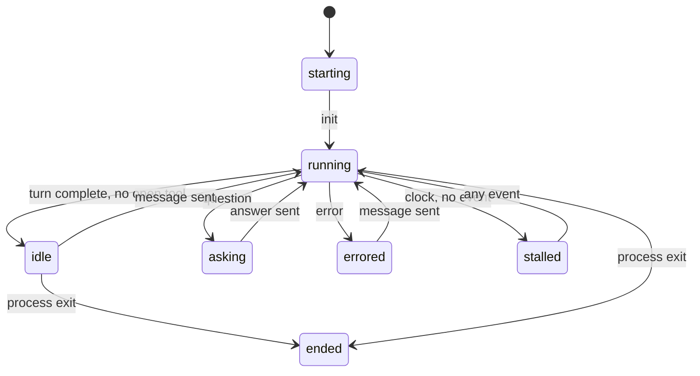

# AA-02 · Build the state reducer

**Status: Needs review.** Epic: [E1](../README.md). Blocks: [AA-03](AA-03-expose-state.md).

## Story

As a person who runs many agents, I want one state per session, so that I see which sessions need me without reading transcripts.

## Scope

- A new package. It has no import from `cmd/relay`.
- A pure function: `Step(state, event, now) -> state`.
- A fixed set of states.
- A count of open tool calls.
- An injected clock for the stalled rule.

## Isolation

The package holds all the rules. Nothing else decides a state.

One rule is weak: a finished turn can mean "done" or "waiting on you". The rule is a function behind a small interface. A later change can replace it with an LLM or a zero-shot classifier. The rest of the package stays the same.

## States

| State | Meaning |
|---|---|
| `starting` | The process starts. No `init` event yet. |
| `running` | A turn is in progress. |
| `idle` | A turn is finished. The session waits for input. |
| `asking` | The harness sent a structured question. |
| `errored` | The harness reported an error. |
| `ended` | The process exited. |
| `stalled` | `running` with no event for N seconds. |
| `needs_permission` | Reserved. Nothing sets it in this epic. |

## Acceptance criteria

- Given the same inputs, when the function runs twice, then it returns the same state.
- Given an `init` event, when state is `starting`, then the new state is `running`.
- Given a turn-complete event and zero open tools, when state is `running`, then the new state is `idle`.
- Given a turn-complete event and one open tool, when state is `running`, then the state stays `running`.
- Given a `question` event, then the new state is `asking`.
- Given N seconds with no event, when state is `running`, then the new state is `stalled`.
- Given an event of an unknown type, then the state does not change. The function reports the event as ignored.
- Given a process exit, then the new state is `ended` from any state.
- Given recorded Claude and pi streams, when a test replays them, then the states match the expected table.
- The package never reads the wall clock. The caller passes `now`.

## Logging

The package does not log. A pure function has no side effect. [AA-03](AA-03-expose-state.md) logs each transition.

## Journey

None. The reducer has no door. [AA-J03](AA-03-expose-state.md) covers it end to end.

## Security impact

None. The package reads canonical events and returns a word. It never reads message text for a decision, except the weak rule above. That rule receives the last message as data. It never runs the text.

## Docs

- A new section in [session-host.md](../../../session-host.md): "Session state".
- [package-layout.md](../../../package-layout.md): the new package row.

## Rollback

Delete the package. Nothing calls it before AA-03.

## Checklist

Status: **Needs review.** An unchecked box marks a known weakness. It has a flag.

### INVEST

- [x] Independent: needs few other stories.
- [x] Negotiable: the detail can change.
- [x] Valuable: someone gains from it.
- [x] Estimable: the team can size it.
- [x] Small: fits one sprint.
- [x] Testable: a test can prove it.

### Quality User Story criteria (13)

- [x] Well-formed: has a role and a means.
- [x] Atomic: asks for one feature.
- [x] Minimal: holds only role, means and end.
- [x] Conceptually sound: the means is a feature and the end is a reason.
- [ ] Problem-oriented: states the problem, not the solution. **Flag:** The title names a solution. The story text names the problem.
- [x] Unambiguous: has one reading.
- [x] Conflict-free: does not clash with another story.
- [x] Full sentence: reads as a full sentence.
- [x] Estimatable: the team can size it.
- [x] Unique: no other story repeats it.
- [x] Uniform: follows the same format as its siblings.
- [x] Independent: needs few other stories.
- [x] Complete: no step is missing from the set.

Unique, uniform, independent, conflict-free and complete are judged across the set. The epic README records that review.

### Definition of ready

This story has acceptance criteria, a journey (or the reason for none), log lines, a security note, a docs list, linked dependencies and a rollback.
