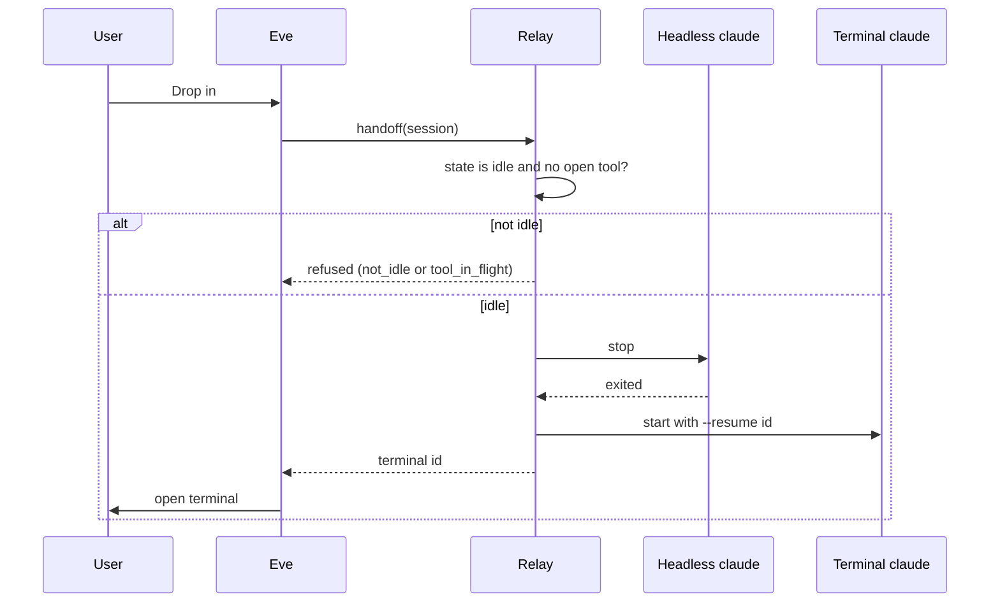

# AA-10 · Drop in to a Claude session on this machine

**Status: Needs review.** Epic: [E1](../README.md). Depends on: [AA-01](AA-01-mint-session-id.md), [AA-03](AA-03-expose-state.md). Blocks: [AA-11](AA-11-handoff-host.md).

## Story

As a person who runs agents headless, I want to take over one session in a terminal, so that I can work with it live.

## Background

A headless session and a terminal session can share one Claude conversation. Both use the same session id. The terminal runs `claude --resume <id>`. The owner confirmed `--session-id` on a local machine.

Two processes must never use one conversation at the same time. Relay stops the headless process first.

## Scope

- A "drop in" action on a session.
- The action works only when the state is `idle` and zero tools run.
- Relay interrupts, stops the headless process, then starts a terminal session with `--resume <id>`.
- The terminal gets the same environment as the headless session.

## Out of scope

- Return from the terminal to headless.
- SSH hosts. That is [AA-11](AA-11-handoff-host.md).
- Codex and pi.

## Sequence

## Acceptance criteria

- Given a session in `idle`, when the user drops in, then a terminal opens with the same conversation.
- Given a session in `running`, when the user drops in, then relay refuses with `not_idle`.
- Given an open tool call, when the user drops in, then relay refuses with `tool_in_flight`.
- Given a state older than N seconds, then relay treats it as unknown and refuses with `state_unknown`.
- Given a successful handoff, then the headless process is gone before the terminal starts.
- Given a failed resume, then relay reports `resume_failed`. The session record stays.
- Given the terminal, then it carries the same permission mode and the same sandbox profile as the headless session.
- Given the hook environment variables, then the terminal receives them. A terminal without them skips the permission hook.

## Logging

| Op | Level | Status | Extra keys | When |
|---|---|---|---|---|
| `session.handoff` | info | ok | `session_id`, `harness_session_id`, `duration_ms` | The terminal runs. |
| `session.handoff` | warn | denied | `session_id`, error `not_idle`, `tool_in_flight` or `state_unknown` | Relay refuses. |
| `session.handoff` | error | error | `session_id`, error `kill_failed` or `resume_failed` | A step fails. |

## Journey

**AA-J10.** Preflight: a devbox with Claude. Steps:

1. Launch a headless session. Send a message that sets a fact.
2. Wait for `idle`.
3. Drop in.
4. In the terminal, ask for the fact. Expect the same answer.

**AA-J10N (negative).** Steps:

1. Start a long-running tool call.
2. Drop in while it runs.
3. Expect `tool_in_flight`. Expect the headless session still running.

## Security impact

The terminal must carry the same limits as the headless session. A weaker profile is a bypass. A test compares both profiles. The handoff action uses the same authorization as a launch.

## Docs

- [session-host.md](../../session-host.md): "Drop-in".
- [FEATURES.md](../../FEATURES.md): a G1 row.

## Rollback

Remove the action. Headless sessions keep working.

## Checklist

Status: **Needs review.** An unchecked box marks a known weakness. It has a flag.

### INVEST

- [ ] Independent: needs few other stories. **Flag:** Needs AA-01 and AA-03.
- [x] Negotiable: the detail can change.
- [x] Valuable: someone gains from it.
- [x] Estimable: the team can size it.
- [x] Small: fits one sprint.
- [x] Testable: a test can prove it.

### Quality User Story criteria (13)

- [x] Well-formed: has a role and a means.
- [x] Atomic: asks for one feature.
- [x] Minimal: holds only role, means and end.
- [x] Conceptually sound: the means is a feature and the end is a reason.
- [x] Problem-oriented: states the problem, not the solution.
- [ ] Unambiguous: has one reading. **Flag:** The staleness limit N has no value yet.
- [x] Conflict-free: does not clash with another story.
- [x] Full sentence: reads as a full sentence.
- [x] Estimatable: the team can size it.
- [x] Unique: no other story repeats it.
- [x] Uniform: follows the same format as its siblings.
- [ ] Independent: needs few other stories. **Flag:** Needs AA-01 and AA-03.
- [x] Complete: no step is missing from the set.

Unique, uniform, independent, conflict-free and complete are judged across the set. The epic README records that review.

### Definition of ready

This story has acceptance criteria, a journey (or the reason for none), log lines, a security note, a docs list, linked dependencies and a rollback.
